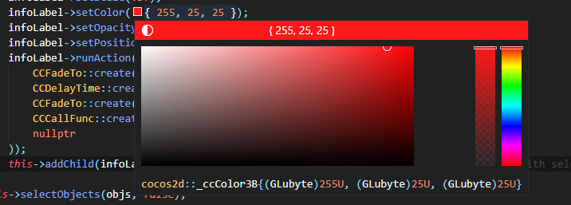
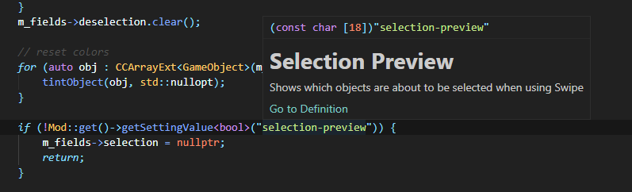
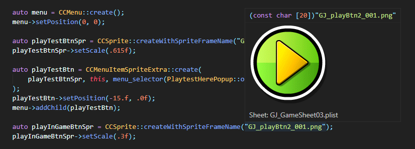

# Geode for VS Code

Support for [Geode](https://geode-sdk.github.io/docs/), the [Geometry Dash](https://store.steampowered.com/app/322170/Geometry_Dash/) modding framework. Features useful utilities for developing Geometry Dash mods.

Requires the [Geode SDK](https://github.com/geode-sdk/geode) and [Geode CLI](https://github.com/geode-sdk/cli) to be installed.

This is a rewrite and enhancement of the previous `geode-support` extension, which was never released due to development issues.

## Features

* Launch GD (`Geode: Launch Geometry Dash` command).
* Validation for `mod.json`
* Sprite browser (Use the `Ctrl + Alt + B` shortcut to launch, or `Geode: Open Sprite Browser`)
* Colorization for `FLAlertLayer` tags
* Inline color hints for `ccColor3B` and `ccColor4B`
* Preview sprites on hover
* View mod setting info on hover

## To-do

* Generate classes
* UI designer
* Possibly some sort of Clippy feature? (Linter)
